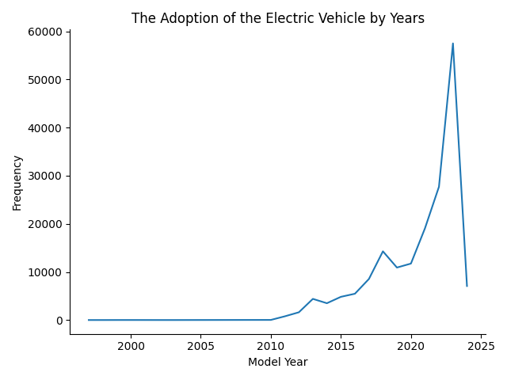
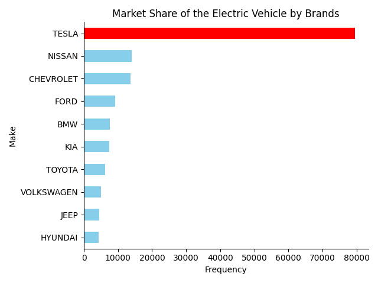
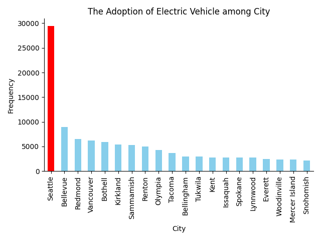
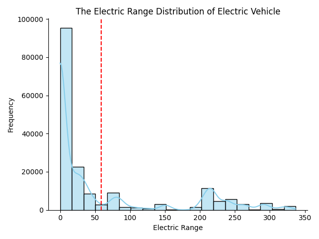
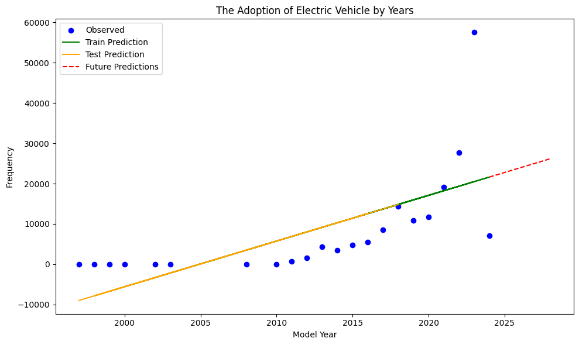

## Title : 
Electric Vehicle Population Analysis

## Project Description : 
This project analyzes the adoption and growth of electric vehicles (EVs) over the years using a dataset of electric vehicle populations. The analysis includes visualizations of EV growth by year, market share among brands, and the distribution of EVs across cities. Additionally, it predicts the future growth of the EV market.

## Installation : 
To run this project, you need to have Python and the following libraries installed:

- pandas
- numpy
- matplotlib
- seaborn
- scikit-learn


## Usage : 
To run this project, follow these steps:

1. **Clone this repository or download the script.**

   - **Clone the repository**: If you have a GitHub repository for this project, you can clone it using the following command:
     ```bash
     git clone <repository-url>
     ```
     Replace `<repository-url>` with the URL of your GitHub repository.

   - **Download the script**: If you don't have a GitHub repository, ensure that the `ev_population_analysis.py` script is downloaded to your local machine.

2. **Ensure you have the required dataset (`Electric_Vehicle_Population_Data.csv`) in the same directory as the script.**

   - Make sure that the dataset file `Electric_Vehicle_Population_Data.csv` is in the same directory where you saved the `ev_population_analysis.py` script. The script reads this file to perform the analysis.

3. **Run the script:**

   Open a terminal or command prompt, navigate to the directory containing the script and the dataset, and run the following command:
   ```bash
   python ev_population_analysis.py

## Project Objectives :
1. Analyze the growth of electric vehicles by year
2. Determine the market share of electric vehicles among different brands
3. Discover the distribution of electric vehicles across various cities
4. Discover the electric range distribution of the electric vehicle
5. Predict the future growth of the electric vehicle market

## Data

### Dataset Overview

The dataset used for this project is `Electric_Vehicle_Population_Data.csv`. It includes various attributes related to electric vehicles, such as their model year, make, city, and electric range. This data helps analyze the growth, distribution, and market share of electric vehicles.

### Data Attributes

- **Model Year**: The year the electric vehicle model was released.
- **Make**: The manufacturer of the electric vehicle.
- **Model**: The specific model of the electric vehicle.
- **Electric Range**: The range of the vehicle on a full charge, measured in miles.
- **City**: The city where the vehicle is registered.

### Obtaining the Dataset

Ensure you have the `Electric_Vehicle_Population_Data.csv` file in the same directory as the script. If you don't have the dataset, you can download it from the [link](https://github.com/ngating/electric_vehicle_data_analysis/blob/5dee4b51b4bb790a4f146259e5f8e8f59bc5822a/dataset/Electric_Vehicle_Population_Data.csv) or check if it's included in the project repository.

#### Example
1. Download the dataset from the [link](https://github.com/ngating/electric_vehicle_data_analysis/blob/5dee4b51b4bb790a4f146259e5f8e8f59bc5822a/dataset/Electric_Vehicle_Population_Data.csv) and save it to your project directory.
2. Verify that the file name is `Electric_Vehicle_Population_Data.csv`.
3. Run the script as described in the "Usage" section to perform the analysis.

## Results

### Summary of Key Findings

- **Growth of Electric Vehicles by Year**: There has been a steady increase in the adoption of electric vehicles over the past decade.
- **Market Share by Brand**: Tesla dominates the electric vehicle market, followed by other major brands like Nissan and Chevrolet.
- **Distribution by City**: Seattle has the highest number of registered electric vehicles among cities.
- **Electric Range Distribution**: Most electric vehicles have an electric range between 100 and 300 miles, with the mean range being approximately 200 miles.
- **Future Predictions**: The trend indicates a continued growth in the adoption of electric vehicles over the next five years.

### Visualizations and Explanations

#### Growth of Electric Vehicles by Year

```python
import pandas as pd
import matplotlib.pyplot as plt

# Load dataset
ev_data_clean = pd.read_csv("Electric_Vehicle_Population_Data.csv").dropna(subset=['Model Year'])

# Count EVs by model year
model_year_counts = ev_data_clean['Model Year'].value_counts().sort_index()

# Plot EV growth trend
ax = model_year_counts.plot(kind='line', marker='o', linestyle='-', color='blue')

# Customize plot appearance
plt.title('The Adoption of Electric Vehicles by Year')
plt.xlabel('Model Year')
plt.ylabel('Frequency')
plt.tight_layout()

# Remove unnecessary spines for a cleaner look
ax.spines[['right', 'top']].set_visible(False)

# Save and display the plot
plt.savefig("images/ev_growth_by_year.png")
plt.show()
plt.close()
```



*Figure: The number of electric vehicles has been increasing steadily year over year. It has sharply increased in the 2020s from 10,000 to 60,000. *

#### Market Share by Brand

```python
Make = 'TESLA'
highlight_color = 'red'
non_highlight_color = 'skyblue'
Make_counts = ev_data_clean['Make'].value_counts().head(10).sort_values(ascending=True)
colors = [highlight_color if make == 'TESLA' else non_highlight_color for make in Make_counts.index]

ax = Make_counts.plot(kind='barh', color=colors)

plt.title('Market Share of the Electric Vehicle by Brands')
plt.xlabel('Frequency')
plt.ylabel('Make')
plt.tight_layout()
ax.spines[['right', 'top']].set_visible(False)
plt.savefig('images/ev_market_share_by_brand.png')
plt.show()
plt.close()
```



*Figure: Tesla has the largest market share among electric vehicle brands, with around 80,000 electric vehicles. Although Chevrolet and Nissan follow, each has only around 15,000 electric vehicles, reflecting that Tesla is the market leader in the electric vehicle industry. *

#### Distribution by City

```python
Make = 'Seattle'
highlight_color = 'red'
non_highlight_color = 'skyblue'

City_counts = ev_data_clean['City'].value_counts().head(20)
colors = [highlight_color if make == 'Seattle' else non_highlight_color for make in City_counts.index]

ax = City_counts.plot(kind='bar',color=colors)
plt.title('The Adoption of Electric Vehicle among City')
plt.xlabel('City')
plt.ylabel('Frequency')
ax.spines [['right', 'top']].set_visible(False)
plt.tight_layout()
plt.savefig('images/ev_growth_by_city.png')
plt.show()
plt.close()
```



*Figure: Seattle has the highest number of registered electric vehicles among cities, with Bellevue and Redmond following. These three cities are located in Washington State, reflecting the higher popularity of electric vehicles in this state. *

#### Electric Range Distribution

```python
ax = sns.histplot(ev_data_clean['Electric Range'],kde=True, bins=20, color= 'skyblue') 

plt.title('The Electric Range Distribution of Electric Vehicle')
plt.xlabel('Electric Range')
plt.ylabel('Frequency')
ax.spines [['right', 'top']].set_visible(False)
plt.axvline(ev_data_clean['Electric Range'].mean(), color='red', linestyle='--', label=f'Mean Range: {ev_data_clean["Electric Range"].mean():.2f} miles')
plt.tight_layout()
plt.savefig('images/ev_electric_range_distribution.png')
plt.show()
plt.close()
```



*Figure: The electric range determines how many miles an electric vehicle can travel before needing a recharge. From the distribution of electric vehicle ranges, most vehicles have a range between 20 and 80 miles. There are only a few vehicles with a high electric range, indicating that a range of 20 to 80 miles meets the needs of most customers. *

#### Future Predictions

```python
from sklearn.model_selection import train_test_split
from sklearn.linear_model import LinearRegression
from sklearn.metrics import mean_squared_error, r2_score
```

```python
# Split the data into training and test sets
X_train, X_test, y_train, y_test = train_test_split(X, y, test_size=0.2, random_state=42)

# Train the linear regression model
model = LinearRegression()
model.fit(X_train, y_train)

# Predict future values (e.g., next 5 years)
future_years = np.arange(2024, 2029).reshape(-1, 1)
predictions = model.predict(future_years)

# Calculate the predicted values for the training and test data
y_train_pred = model.predict(X_train)
y_test_pred = model.predict(X_test)

# Plot the results
plt.figure(figsize=(10, 6))
plt.scatter(model_year_series['Model Year'], model_year_series['Count'], label='Observed', color='blue')
plt.plot(X_train, y_train_pred, label='Train Prediction', color='green')
plt.plot(X_test, y_test_pred, label='Test Prediction', color='orange')
plt.plot(future_years, predictions, label='Future Predictions', color='red', linestyle='dashed')
plt.title('Predict the Adoption of Electric Vehicle in 2024 - 2029')
plt.xlabel('Model Year')
plt.ylabel('Frequency')
plt.legend()
plt.tight_layout()
plt.savefig('images/ev_growth_prediction.png')
plt.show()
plt.close()

# Print the mean squared error and r-squared for model evaluation
mse_train = mean_squared_error(y_train, y_train_pred)
mse_test = mean_squared_error(y_test, y_test_pred)
r2 = r2_score(y_test, y_test_pred)
print(f'Mean Squared Error (Train): {mse_train}')
print(f'Mean Squared Error (Test): {mse_test}')
print(f'R-squared:{r2}') 
```



*Figure: The growth in the number of electric vehicles is increasing. Although the number in 2024 has significantly dropped, this may be due to incomplete records. The number of electric vehicle adoptions is expected to continue increasing in the next five years. *


This README provides a clear overview of your project and its results without the need for a license.

