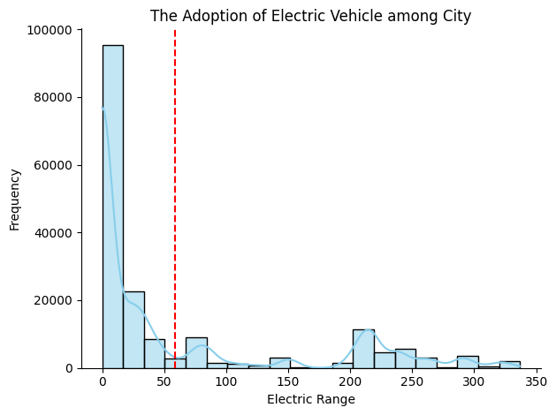
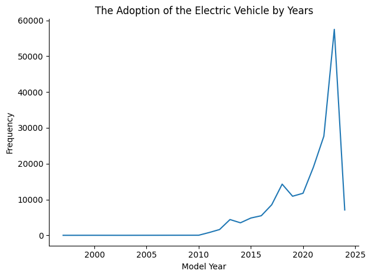

```python
import pandas as pd
import numpy as np
import matplotlib.pyplot as plt
import seaborn as sns
```


```python
ev_data = pd.read_csv('/Users/ngating/Desktop/Data engineer project/Electric_Vehicle_Population_Data.csv')
```


```python
ev_data.head()
```


<div>
<style scoped>
    .dataframe tbody tr th:only-of-type {
        vertical-align: middle;
    }

    .dataframe tbody tr th {
        vertical-align: top;
    }

    .dataframe thead th {
        text-align: right;
    }
</style>
<table border="1" class="dataframe">
  <thead>
    <tr style="text-align: right;">
      <th></th>
      <th>VIN (1-10)</th>
      <th>County</th>
      <th>City</th>
      <th>State</th>
      <th>Postal Code</th>
      <th>Model Year</th>
      <th>Make</th>
      <th>Model</th>
      <th>Electric Vehicle Type</th>
      <th>Clean Alternative Fuel Vehicle (CAFV) Eligibility</th>
      <th>Electric Range</th>
      <th>Base MSRP</th>
      <th>Legislative District</th>
      <th>DOL Vehicle ID</th>
      <th>Vehicle Location</th>
      <th>Electric Utility</th>
      <th>2020 Census Tract</th>
    </tr>
  </thead>
  <tbody>
    <tr>
      <th>0</th>
      <td>5YJYGDEE1L</td>
      <td>King</td>
      <td>Seattle</td>
      <td>WA</td>
      <td>98122.0</td>
      <td>2020</td>
      <td>TESLA</td>
      <td>MODEL Y</td>
      <td>Battery Electric Vehicle (BEV)</td>
      <td>Clean Alternative Fuel Vehicle Eligible</td>
      <td>291</td>
      <td>0</td>
      <td>37.0</td>
      <td>125701579</td>
      <td>POINT (-122.30839 47.610365)</td>
      <td>CITY OF SEATTLE - (WA)|CITY OF TACOMA - (WA)</td>
      <td>5.303301e+10</td>
    </tr>
    <tr>
      <th>1</th>
      <td>7SAYGDEE9P</td>
      <td>Snohomish</td>
      <td>Bothell</td>
      <td>WA</td>
      <td>98021.0</td>
      <td>2023</td>
      <td>TESLA</td>
      <td>MODEL Y</td>
      <td>Battery Electric Vehicle (BEV)</td>
      <td>Eligibility unknown as battery range has not b...</td>
      <td>0</td>
      <td>0</td>
      <td>1.0</td>
      <td>244285107</td>
      <td>POINT (-122.179458 47.802589)</td>
      <td>PUGET SOUND ENERGY INC</td>
      <td>5.306105e+10</td>
    </tr>
    <tr>
      <th>2</th>
      <td>5YJSA1E4XK</td>
      <td>King</td>
      <td>Seattle</td>
      <td>WA</td>
      <td>98109.0</td>
      <td>2019</td>
      <td>TESLA</td>
      <td>MODEL S</td>
      <td>Battery Electric Vehicle (BEV)</td>
      <td>Clean Alternative Fuel Vehicle Eligible</td>
      <td>270</td>
      <td>0</td>
      <td>36.0</td>
      <td>156773144</td>
      <td>POINT (-122.34848 47.632405)</td>
      <td>CITY OF SEATTLE - (WA)|CITY OF TACOMA - (WA)</td>
      <td>5.303301e+10</td>
    </tr>
    <tr>
      <th>3</th>
      <td>5YJSA1E27G</td>
      <td>King</td>
      <td>Issaquah</td>
      <td>WA</td>
      <td>98027.0</td>
      <td>2016</td>
      <td>TESLA</td>
      <td>MODEL S</td>
      <td>Battery Electric Vehicle (BEV)</td>
      <td>Clean Alternative Fuel Vehicle Eligible</td>
      <td>210</td>
      <td>0</td>
      <td>5.0</td>
      <td>165103011</td>
      <td>POINT (-122.03646 47.534065)</td>
      <td>PUGET SOUND ENERGY INC||CITY OF TACOMA - (WA)</td>
      <td>5.303303e+10</td>
    </tr>
    <tr>
      <th>4</th>
      <td>5YJYGDEE5M</td>
      <td>Kitsap</td>
      <td>Suquamish</td>
      <td>WA</td>
      <td>98392.0</td>
      <td>2021</td>
      <td>TESLA</td>
      <td>MODEL Y</td>
      <td>Battery Electric Vehicle (BEV)</td>
      <td>Eligibility unknown as battery range has not b...</td>
      <td>0</td>
      <td>0</td>
      <td>23.0</td>
      <td>205138552</td>
      <td>POINT (-122.55717 47.733415)</td>
      <td>PUGET SOUND ENERGY INC</td>
      <td>5.303594e+10</td>
    </tr>
  </tbody>
</table>
</div>


```python
ev_data.info()
```

    <class 'pandas.core.frame.DataFrame'>
    RangeIndex: 177866 entries, 0 to 177865
    Data columns (total 17 columns):
     #   Column                                             Non-Null Count   Dtype  
    ---  ------                                             --------------   -----  
     0   VIN (1-10)                                         177866 non-null  object 
     1   County                                             177861 non-null  object 
     2   City                                               177861 non-null  object 
     3   State                                              177866 non-null  object 
     4   Postal Code                                        177861 non-null  float64
     5   Model Year                                         177866 non-null  int64  
     6   Make                                               177866 non-null  object 
     7   Model                                              177866 non-null  object 
     8   Electric Vehicle Type                              177866 non-null  object 
     9   Clean Alternative Fuel Vehicle (CAFV) Eligibility  177866 non-null  object 
     10  Electric Range                                     177866 non-null  int64  
     11  Base MSRP                                          177866 non-null  int64  
     12  Legislative District                               177477 non-null  float64
     13  DOL Vehicle ID                                     177866 non-null  int64  
     14  Vehicle Location                                   177857 non-null  object 
     15  Electric Utility                                   177861 non-null  object 
     16  2020 Census Tract                                  177861 non-null  float64
    dtypes: float64(3), int64(4), object(10)
    memory usage: 23.1+ MB


```python
ev_data.describe()
```


<div>
<style scoped>
    .dataframe tbody tr th:only-of-type {
        vertical-align: middle;
    }

    .dataframe tbody tr th {
        vertical-align: top;
    }

    .dataframe thead th {
        text-align: right;
    }
</style>
<table border="1" class="dataframe">
  <thead>
    <tr style="text-align: right;">
      <th></th>
      <th>Postal Code</th>
      <th>Model Year</th>
      <th>Electric Range</th>
      <th>Base MSRP</th>
      <th>Legislative District</th>
      <th>DOL Vehicle ID</th>
      <th>2020 Census Tract</th>
    </tr>
  </thead>
  <tbody>
    <tr>
      <th>count</th>
      <td>177861.000000</td>
      <td>177866.000000</td>
      <td>177866.000000</td>
      <td>177866.000000</td>
      <td>177477.000000</td>
      <td>1.778660e+05</td>
      <td>1.778610e+05</td>
    </tr>
    <tr>
      <th>mean</th>
      <td>98172.453506</td>
      <td>2020.515512</td>
      <td>58.842162</td>
      <td>1073.109363</td>
      <td>29.127481</td>
      <td>2.202313e+08</td>
      <td>5.297672e+10</td>
    </tr>
    <tr>
      <th>std</th>
      <td>2442.450668</td>
      <td>2.989384</td>
      <td>91.981298</td>
      <td>8358.624956</td>
      <td>14.892169</td>
      <td>7.584987e+07</td>
      <td>1.578047e+09</td>
    </tr>
    <tr>
      <th>min</th>
      <td>1545.000000</td>
      <td>1997.000000</td>
      <td>0.000000</td>
      <td>0.000000</td>
      <td>1.000000</td>
      <td>4.385000e+03</td>
      <td>1.001020e+09</td>
    </tr>
    <tr>
      <th>25%</th>
      <td>98052.000000</td>
      <td>2019.000000</td>
      <td>0.000000</td>
      <td>0.000000</td>
      <td>18.000000</td>
      <td>1.814743e+08</td>
      <td>5.303301e+10</td>
    </tr>
    <tr>
      <th>50%</th>
      <td>98122.000000</td>
      <td>2022.000000</td>
      <td>0.000000</td>
      <td>0.000000</td>
      <td>33.000000</td>
      <td>2.282522e+08</td>
      <td>5.303303e+10</td>
    </tr>
    <tr>
      <th>75%</th>
      <td>98370.000000</td>
      <td>2023.000000</td>
      <td>75.000000</td>
      <td>0.000000</td>
      <td>42.000000</td>
      <td>2.548445e+08</td>
      <td>5.305307e+10</td>
    </tr>
    <tr>
      <th>max</th>
      <td>99577.000000</td>
      <td>2024.000000</td>
      <td>337.000000</td>
      <td>845000.000000</td>
      <td>49.000000</td>
      <td>4.792548e+08</td>
      <td>5.603300e+10</td>
    </tr>
  </tbody>
</table>
</div>


```python
ev_data.isna().sum()
```


    VIN (1-10)                                             0
    County                                                 5
    City                                                   5
    State                                                  0
    Postal Code                                            5
    Model Year                                             0
    Make                                                   0
    Model                                                  0
    Electric Vehicle Type                                  0
    Clean Alternative Fuel Vehicle (CAFV) Eligibility      0
    Electric Range                                         0
    Base MSRP                                              0
    Legislative District                                 389
    DOL Vehicle ID                                         0
    Vehicle Location                                       9
    Electric Utility                                       5
    2020 Census Tract                                      5
    dtype: int64


```python
ev_data_clean = ev_data.dropna()
```


```python
ev_data_clean.isna().sum()
```


    VIN (1-10)                                           0
    County                                               0
    City                                                 0
    State                                                0
    Postal Code                                          0
    Model Year                                           0
    Make                                                 0
    Model                                                0
    Electric Vehicle Type                                0
    Clean Alternative Fuel Vehicle (CAFV) Eligibility    0
    Electric Range                                       0
    Base MSRP                                            0
    Legislative District                                 0
    DOL Vehicle ID                                       0
    Vehicle Location                                     0
    Electric Utility                                     0
    2020 Census Tract                                    0
    dtype: int64


# Objective of the project 
## The Population of Electric Vehicle Over The Years
### - The growth of the Electric Vehicle by years
### - The Market Share of the Electric Vehicle among brand
### - Discover the number of Electric Vehicle among the State
### - Predict the growth of the Electric Vehicle makret


```python
model_year_counts = ev_data_clean['Model Year'].value_counts().sort_index()
ax = model_year_counts.plot(kind='line')
plt.title('The Adoption of the Electric Vehicle by Years')
plt.xlabel('Model Year')
plt.ylabel('Frequency')
plt.tight_layout()
ax.spines[['right', 'top']].set_visible(False)
plt.show()
#sort_index() means the index(e.g 2011,2012,2013) will present in ascending order, 
#if it is used in the index of brand, the brand name will be arranged in ascending order as well

```


    

    


```python
Make = 'TESLA'
highlight_color = 'red'
non_highlight_color = 'skyblue'
Make_counts = ev_data_clean['Make'].value_counts().head(10).sort_values(ascending=True)
colors = [highlight_color if make == 'TESLA' else non_highlight_color for make in Make_counts.index]

ax = Make_counts.plot(kind='barh', color=colors)

plt.title('Market Share of the Electric Vehicle by Brands')
plt.xlabel('Frequency')
plt.ylabel('Make')
plt.tight_layout()
ax.spines[['right', 'top']].set_visible(False)
plt.show()
```


    

    


```python
Make = 'Seattle'
highlight_color = 'red'
non_highlight_color = 'skyblue'

City_counts = ev_data_clean['City'].value_counts().head(20)
colors = [highlight_color if make == 'Seattle' else non_highlight_color for make in City_counts.index]

ax = City_counts.plot(kind='bar',color=colors)
plt.title('The Adoption of Electric Vehicle among City')
plt.xlabel('City')
plt.ylabel('Frequency')
ax.spines [['right', 'top']].set_visible(False)
plt.tight_layout()
plt.show()
```


    

    


```python
ax = sns.histplot(ev_data_clean['Electric Range'],kde=True, bins=20, color= 'skyblue') 

plt.title('The Adoption of Electric Vehicle among City')
plt.xlabel('Electric Range')
plt.ylabel('Frequency')
ax.spines [['right', 'top']].set_visible(False)
plt.axvline(ev_data_clean['Electric Range'].mean(), color='red', linestyle='--', label=f'Mean Range: {ev_data_clean["Electric Range"].mean():.2f} miles')
plt.tight_layout()
plt.show()
```


    

    


```python
ev_data_clean.loc[ev_data_clean['Model Year'] ==2024].sum
```


    <bound method DataFrame.sum of         VIN (1-10)       County           City State  Postal Code  Model Year  \
    33      KNDAEFS54R    Snohomish          Brier    WA      98036.0        2024   
    83      JTMEB3FV0R      Spokane        Spokane    WA      99203.0        2024   
    91      1C4RJXN68R    Snohomish       Lynnwood    WA      98037.0        2024   
    152     KM8JBDD23R    Snohomish        Bothell    WA      98012.0        2024   
    186     JTJHKCFZ8R  Walla Walla    Walla Walla    WA      99362.0        2024   
    ...            ...          ...            ...   ...          ...         ...   
    177694  JM3KKEHA1R         King        Seattle    WA      98121.0        2024   
    177758  JTMFB3FV7R     Franklin          Pasco    WA      99301.0        2024   
    177808  KMHM34AC8R         King         Burien    WA      98168.0        2024   
    177821  KNDADFS55R       Pierce     South Hill    WA      98375.0        2024   
    177844  1C4RJXN68R         King  Black Diamond    WA      98010.0        2024   
    
               Make       Model                   Electric Vehicle Type  \
    33          KIA         EV9          Battery Electric Vehicle (BEV)   
    83       TOYOTA  RAV4 PRIME  Plug-in Hybrid Electric Vehicle (PHEV)   
    91         JEEP    WRANGLER  Plug-in Hybrid Electric Vehicle (PHEV)   
    152     HYUNDAI      TUCSON  Plug-in Hybrid Electric Vehicle (PHEV)   
    186       LEXUS          NX  Plug-in Hybrid Electric Vehicle (PHEV)   
    ...         ...         ...                                     ...   
    177694    MAZDA       CX-90  Plug-in Hybrid Electric Vehicle (PHEV)   
    177758   TOYOTA  RAV4 PRIME  Plug-in Hybrid Electric Vehicle (PHEV)   
    177808  HYUNDAI     IONIQ 6          Battery Electric Vehicle (BEV)   
    177821      KIA         EV9          Battery Electric Vehicle (BEV)   
    177844     JEEP    WRANGLER  Plug-in Hybrid Electric Vehicle (PHEV)   
    
            Clean Alternative Fuel Vehicle (CAFV) Eligibility  Electric Range  \
    33      Eligibility unknown as battery range has not b...               0   
    83                Clean Alternative Fuel Vehicle Eligible              42   
    91                  Not eligible due to low battery range              21   
    152               Clean Alternative Fuel Vehicle Eligible              33   
    186               Clean Alternative Fuel Vehicle Eligible              37   
    ...                                                   ...             ...   
    177694              Not eligible due to low battery range              26   
    177758            Clean Alternative Fuel Vehicle Eligible              42   
    177808  Eligibility unknown as battery range has not b...               0   
    177821  Eligibility unknown as battery range has not b...               0   
    177844              Not eligible due to low battery range              21   
    
            Base MSRP  Legislative District  DOL Vehicle ID  \
    33              0                   1.0       260657281   
    83              0                   6.0       259789841   
    91              0                  32.0       252678051   
    152             0                  21.0       256150562   
    186             0                  16.0       257774296   
    ...           ...                   ...             ...   
    177694          0                  36.0       261157613   
    177758          0                  16.0       259659333   
    177808          0                  33.0       260226326   
    177821          0                  25.0       261095684   
    177844          0                   5.0       250998051   
    
                           Vehicle Location  \
    33        POINT (-122.316675 47.819365)   
    83        POINT (-117.425265 47.635365)   
    91         POINT (-122.297265 47.84182)   
    152         POINT (-122.1873 47.820245)   
    186        POINT (-118.34332 46.063985)   
    ...                                 ...   
    177694     POINT (-122.344125 47.61546)   
    177758      POINT (-119.0982 46.232395)   
    177808       POINT (-122.286465 47.476)   
    177821  POINT (-122.3085456 47.1042426)   
    177844     POINT (-122.00451 47.312185)   
    
                                             Electric Utility  2020 Census Tract  
    33                                 PUGET SOUND ENERGY INC       5.306105e+10  
    83                          MODERN ELECTRIC WATER COMPANY       5.306300e+10  
    91                                 PUGET SOUND ENERGY INC       5.306105e+10  
    152                                PUGET SOUND ENERGY INC       5.306105e+10  
    186                                            PACIFICORP       5.307192e+10  
    ...                                                   ...                ...  
    177694       CITY OF SEATTLE - (WA)|CITY OF TACOMA - (WA)       5.303301e+10  
    177758  BONNEVILLE POWER ADMINISTRATION||PUD NO 1 OF F...       5.302102e+10  
    177808       CITY OF SEATTLE - (WA)|CITY OF TACOMA - (WA)       5.303303e+10  
    177821  BONNEVILLE POWER ADMINISTRATION||CITY OF TACOM...       5.305307e+10  
    177844      PUGET SOUND ENERGY INC||CITY OF TACOMA - (WA)       5.303303e+10  
    
    [7072 rows x 17 columns]>


```python
ev_data_predict = ev_data_clean.loc[ev_data_clean['Model Year'] < 2024]
```


```python
model_year_counts = ev_data_clean['Model Year'].value_counts().sort_index()
ax = model_year_counts.plot(kind='line')
plt.title('The Adoption of the Electric Vehicle by Years')
plt.xlabel('Model Year')
plt.ylabel('Frequency')
plt.tight_layout()
ax.spines[['right', 'top']].set_visible(False)
plt.show()
```


    

    


```python
from sklearn.model_selection import train_test_split
from sklearn.linear_model import LinearRegression
from sklearn.metrics import mean_squared_error, r2_score
```


```python
model_year_counts = ev_data_clean['Model Year'].value_counts().sort_index()
model_year_series = pd.Series(model_year_counts)
model_year_series = model_year_series.reset_index()
model_year_series.columns = ['Model Year', 'Count']
print(model_year_series)
```

        Model Year  Count
    0         1997      1
    1         1998      1
    2         1999      5
    3         2000      7
    4         2002      2
    5         2003      1
    6         2008     19
    7         2010     23
    8         2011    775
    9         2012   1614
    10        2013   4399
    11        2014   3496
    12        2015   4826
    13        2016   5469
    14        2017   8534
    15        2018  14286
    16        2019  10913
    17        2020  11740
    18        2021  19063
    19        2022  27708
    20        2023  57519
    21        2024   7072


```python
# Convert the years into numerical values
X = model_year_series['Model Year'].values.reshape(-1, 1)
y = model_year_series['Count'].values
print(X)
print(y)
```

    [[1997]
     [1998]
     [1999]
     [2000]
     [2002]
     [2003]
     [2008]
     [2010]
     [2011]
     [2012]
     [2013]
     [2014]
     [2015]
     [2016]
     [2017]
     [2018]
     [2019]
     [2020]
     [2021]
     [2022]
     [2023]
     [2024]]
    [    1     1     5     7     2     1    19    23   775  1614  4399  3496
      4826  5469  8534 14286 10913 11740 19063 27708 57519  7072]


```python
# Split the data into training and test sets
X_train, X_test, y_train, y_test = train_test_split(X, y, test_size=0.2, random_state=42)

# Train the linear regression model
model = LinearRegression()
model.fit(X_train, y_train)

# Predict future values (e.g., next 5 years)
future_years = np.arange(2024, 2029).reshape(-1, 1)
predictions = model.predict(future_years)

# Calculate the predicted values for the training and test data
y_train_pred = model.predict(X_train)
y_test_pred = model.predict(X_test)

# Plot the results
plt.figure(figsize=(10, 6))
plt.scatter(model_year_series['Model Year'], model_year_series['Count'], label='Observed', color='blue')
plt.plot(X_train, y_train_pred, label='Train Prediction', color='green')
plt.plot(X_test, y_test_pred, label='Test Prediction', color='orange')
plt.plot(future_years, predictions, label='Future Predictions', color='red', linestyle='dashed')
plt.title('The Adoption of Electric Vehicle by Years')
plt.xlabel('Model Year')
plt.ylabel('Frequency')
plt.legend()
plt.tight_layout()
plt.show()

# Print the mean squared error and r-squared for model evaluation
mse_train = mean_squared_error(y_train, y_train_pred)
mse_test = mean_squared_error(y_test, y_test_pred)
r2 = r2_score(y_test, y_test_pred)
print(f'Mean Squared Error (Train): {mse_train}')
print(f'Mean Squared Error (Test): {mse_test}')
print(f'R-squared:{r2}') 
```


    

    


    Mean Squared Error (Train): 119075484.05536568
    Mean Squared Error (Test): 45992469.934172444
    R-squared:-0.5301467018474797

